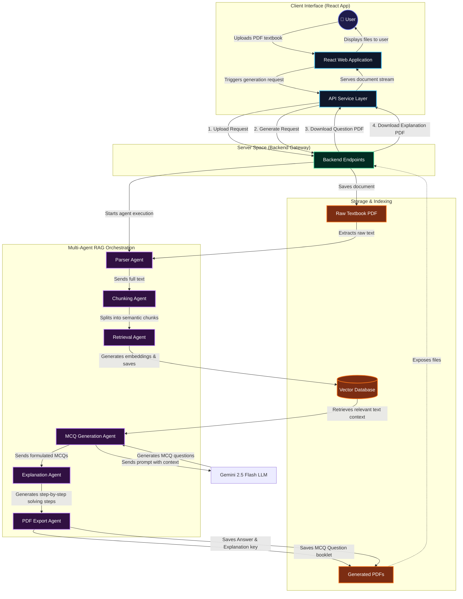
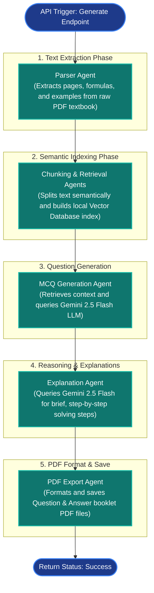
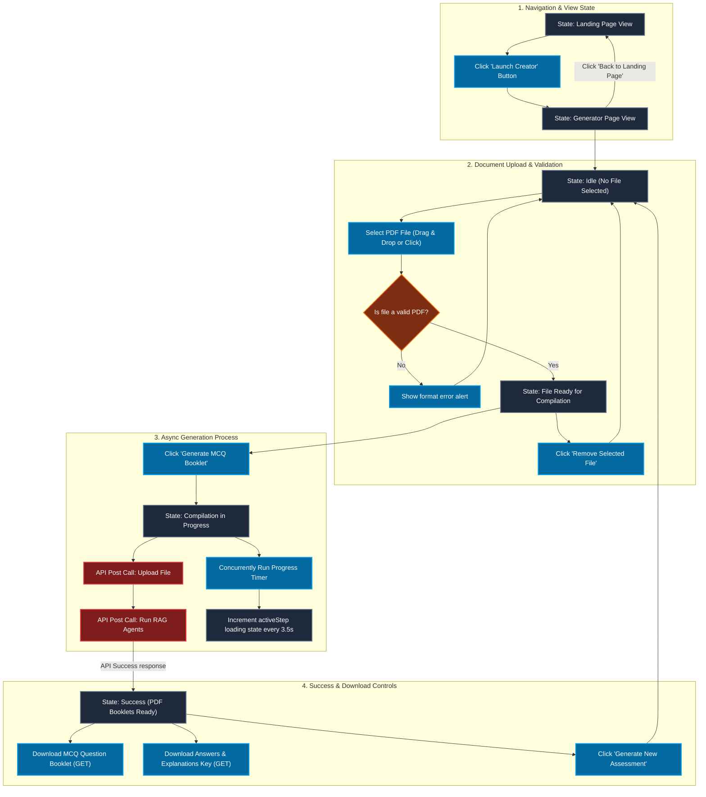
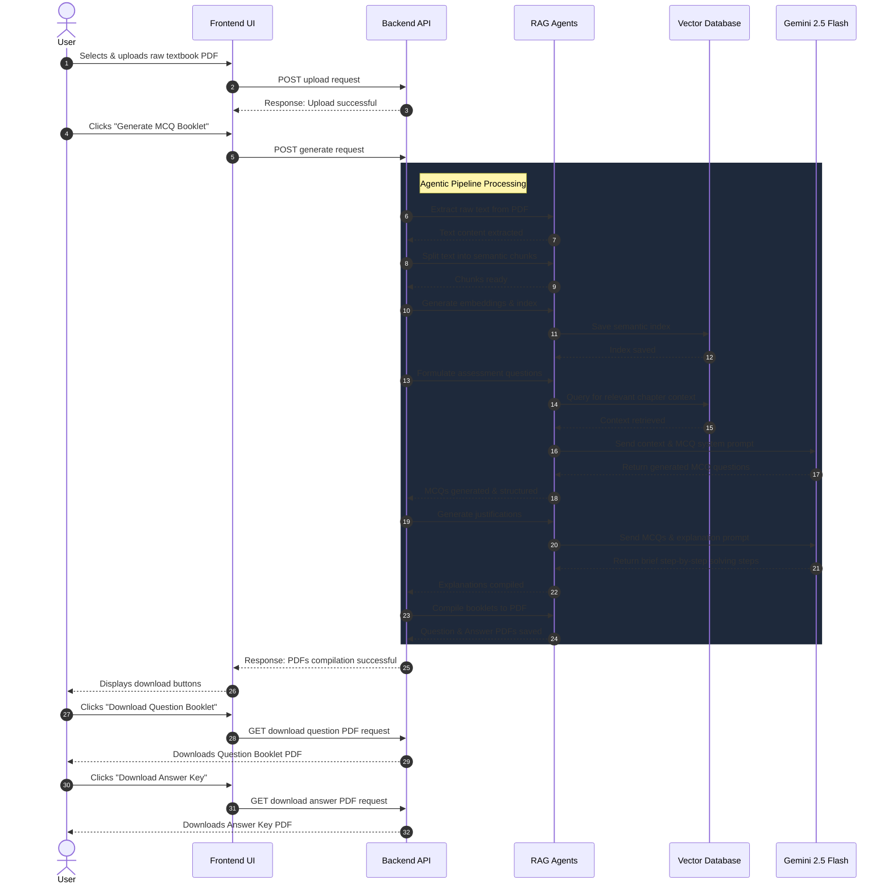
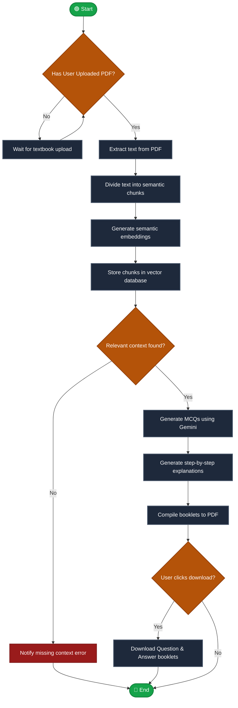

## 1. Full System Architecture Flow

```mermaid
flowchart TB
    %% Styling Classes
    classDef userStyle fill:#1e1b4b,stroke:#818cf8,stroke-width:2px,color:#fff;
    classDef frontStyle fill:#0f172a,stroke:#38bdf8,stroke-width:2px,color:#fff;
    classDef backStyle fill:#022c22,stroke:#34d399,stroke-width:2px,color:#fff;
    classDef agentStyle fill:#311042,stroke:#c084fc,stroke-width:2px,color:#fff;
    classDef storageStyle fill:#7c2d12,stroke:#f97316,stroke-width:2px,color:#fff;
    classDef outputStyle fill:#1c1917,stroke:#a8a29e,stroke-width:2px,color:#fff;

    %% Global Subgraphs
    subgraph FrontendSpace["Client Interface (React App)"]
        User(("👤 User")):::userStyle
        UI["React Web Application"]:::frontStyle
        API_Client["API Service Layer"]:::frontStyle
    end

    subgraph BackendSpace["Server Space (Backend Gateway)"]
        API_Routes["Backend Endpoints"]:::backStyle
    end

    subgraph AgenticRAG["Multi-Agent RAG Orchestration"]
        ParserAgent["Parser Agent"]:::agentStyle
        ChunkingAgent["Chunking Agent"]:::agentStyle
        RetrievalAgent["Retrieval Agent"]:::agentStyle
        MCQGenAgent["MCQ Generation Agent"]:::agentStyle
        ExplAgent["Explanation Agent"]:::agentStyle
        PDFExportAgent["PDF Export Agent"]:::agentStyle
    end

    subgraph StorageSpace["Storage & Indexing"]
        RawPDF["Raw Textbook PDF"]:::storageStyle
        VectorStore[("Vector Database")]:::storageStyle
        OutputsDir["Generated PDFs"]:::storageStyle
    end

    %% Flow Relationships
    User -->|Uploads PDF textbook| UI
    UI -->|Triggers generation request| API_Client
    
    %% API Routes Interactions
    API_Client -->|1. Upload Request| API_Routes
    API_Routes -->|Saves document| RawPDF
    
    API_Client -->|2. Generate Request| API_Routes
    API_Routes -->|Starts agent execution| ParserAgent
    
    %% RAG Pipeline Sequence
    RawPDF -->|Extracts raw text| ParserAgent
    ParserAgent -->|Sends full text| ChunkingAgent
    ChunkingAgent -->|Splits into semantic chunks| RetrievalAgent
    RetrievalAgent -->|Generates embeddings & saves| VectorStore
    
    VectorStore -->|Retrieves relevant text context| MCQGenAgent
    MCQGenAgent -->|Sends prompt with context| GeminiLLM["Gemini 2.5 Flash LLM"]
    GeminiLLM -->|Generates MCQ questions| MCQGenAgent
    
    MCQGenAgent -->|Sends formulated MCQs| ExplAgent
    ExplAgent -->|Generates step-by-step solving steps| PDFExportAgent
    
    PDFExportAgent -->|Saves MCQ Question booklet| OutputsDir
    PDFExportAgent -->|Saves Answer & Explanation key| OutputsDir
    
    %% Downloads
    OutputsDir -.->|Exposes files| API_Routes
    API_Routes -->|3. Download Question PDF| API_Client
    API_Routes -->|4. Download Explanation PDF| API_Client
    API_Client -->|Serves document stream| UI
    UI -->|Displays files to user| User
```

---

## 2. Backend Flow

```mermaid
flowchart TD
    %% Styling Classes
    classDef endpointStyle fill:#1e3a8a,stroke:#3b82f6,stroke-width:2px,color:#fff;
    classDef stageStyle fill:#111827,stroke:#374151,stroke-width:2px,color:#fff;
    classDef nodeStyle fill:#0f766e,stroke:#14b8a6,stroke-width:2px,color:#fff;

    StartGen(["API Trigger: Generate Endpoint"]):::endpointStyle

    subgraph Stage1["1. Text Extraction Phase"]
        Parser["Parser Agent<br/>(Extracts pages, formulas, and examples from raw PDF textbook)"]:::nodeStyle
    end

    subgraph Stage2["2. Semantic Indexing Phase"]
        Chunker["Chunking & Retrieval Agents<br/>(Splits text semantically and builds local Vector Database index)"]:::nodeStyle
    end

    subgraph Stage3["3. Question Generation"]
        MCQGen["MCQ Generation Agent<br/>(Retrieves context and queries Gemini 2.5 Flash LLM)"]:::nodeStyle
    end

    subgraph Stage4["4. Reasoning & Explanations"]
        ExplGen["Explanation Agent<br/>(Queries Gemini 2.5 Flash for brief, step-by-step solving steps)"]:::nodeStyle
    end

    subgraph Stage5["5. PDF Format & Save"]
        Exporter["PDF Export Agent<br/>(Formats and saves Question & Answer booklet PDF files)"]:::nodeStyle
    end

    StartGen --> Parser
    Parser --> Chunker
    Chunker --> MCQGen
    MCQGen --> ExplGen
    ExplGen --> Exporter
    Exporter --> FinishGen(["Return Status: Success"]):::endpointStyle
```

---

## 3. Frontend Flow

```mermaid
flowchart TD
    %% Styling Classes
    classDef stateStyle fill:#1e293b,stroke:#64748b,stroke-width:2px,color:#fff;
    classDef actionStyle fill:#0369a1,stroke:#0ea5e9,stroke-width:2px,color:#fff;
    classDef apiStyle fill:#7f1d1d,stroke:#ef4444,stroke-width:2px,color:#fff;
    classDef conditionStyle fill:#7c2d12,stroke:#f97316,stroke-width:2px,color:#fff;

    %% STAGE 1: Navigation & View State
    subgraph Stage1["1. Navigation & View State"]
        direction TB
        Landing["State: Landing Page View"]:::stateStyle
        Launch["Click 'Launch Creator' Button"]:::actionStyle
        GenView["State: Generator Page View"]:::stateStyle
        
        Landing --> Launch
        Launch --> GenView
        GenView -->|Click 'Back to Landing Page'| Landing
    end

    %% STAGE 2: Upload Stage
    subgraph Stage2["2. Document Upload & Validation"]
        direction TB
        Idle["State: Idle (No File Selected)"]:::stateStyle
        SelectFile["Select PDF File (Drag & Drop or Click)"]:::actionStyle
        ValidatePDF{"Is file a valid PDF?"}:::conditionStyle
        AlertError["Show format error alert"]:::actionStyle
        FileLoaded["State: File Ready for Compilation"]:::stateStyle
        RemoveFile["Click 'Remove Selected File'"]:::actionStyle

        GenView --> Idle
        Idle --> SelectFile
        SelectFile --> ValidatePDF
        ValidatePDF -->|No| AlertError
        AlertError --> Idle
        ValidatePDF -->|Yes| FileLoaded
        FileLoaded --> RemoveFile
        RemoveFile --> Idle
    end

    %% STAGE 3: Processing Stage
    subgraph Stage3["3. Async Generation Process"]
        direction TB
        StartGen["Click 'Generate MCQ Booklet'"]:::actionStyle
        ProcessActive["State: Compilation in Progress"]:::stateStyle
        UploadRequest["API Post Call: Upload File"]:::apiStyle
        GenerateRequest["API Post Call: Run RAG Agents"]:::apiStyle
        TimerRun["Concurrently Run Progress Timer"]:::actionStyle
        TimelineUI["Increment activeStep loading state every 3.5s"]:::stateStyle
        
        FileLoaded --> StartGen
        StartGen --> ProcessActive
        ProcessActive --> UploadRequest
        UploadRequest --> GenerateRequest
        
        ProcessActive --> TimerRun
        TimerRun --> TimelineUI
    end

    %% STAGE 4: Completion & Download Stage
    subgraph Stage4["4. Success & Download Controls"]
        direction TB
        Success["State: Success (PDF Booklets Ready)"]:::stateStyle
        DownloadMCQ["Download MCQ Question Booklet (GET)"]:::actionStyle
        DownloadAns["Download Answers & Explanations Key (GET)"]:::actionStyle
        ResetBtn["Click 'Generate New Assessment'"]:::actionStyle
        
        GenerateRequest -->|API Success response| Success
        Success --> DownloadMCQ
        Success --> DownloadAns
        Success --> ResetBtn
        ResetBtn --> Idle
    end
```

---

## 4. End-to-End System Sequence Diagram

```mermaid
sequenceDiagram
    autonumber
    actor User as User
    participant UI as Frontend UI
    participant Backend as Backend API
    participant RAG as RAG Agents
    participant DB as Vector Database
    participant LLM as Gemini 2.5 Flash

    %% 1. Upload Phase
    User->>UI: Selects & uploads raw textbook PDF
    UI->>Backend: POST upload request
    Backend-->>UI: Response: Upload successful

    %% 2. Generation Phase
    User->>UI: Clicks "Generate MCQ Booklet"
    UI->>Backend: POST generate request
    
    rect rgb(30, 41, 59)
        note right of Backend: Agentic Pipeline Processing
        Backend->>RAG: Extract raw text from PDF
        RAG-->>Backend: Text content extracted
        
        Backend->>RAG: Split text into semantic chunks
        RAG-->>Backend: Chunks ready
        
        Backend->>RAG: Generate embeddings & index
        RAG->>DB: Save semantic index
        DB-->>RAG: Index saved
        
        Backend->>RAG: Formulate assessment questions
        RAG->>DB: Query for relevant chapter context
        DB-->>RAG: Context retrieved
        RAG->>LLM: Send context & MCQ system prompt
        LLM-->>RAG: Return generated MCQ questions
        RAG-->>Backend: MCQs generated & structured
        
        Backend->>RAG: Generate justifications
        RAG->>LLM: Send MCQs & explanation prompt
        LLM-->>RAG: Return brief step-by-step solving steps
        RAG-->>Backend: Explanations compiled
        
        Backend->>RAG: Compile booklets to PDF
        RAG-->>Backend: Question & Answer PDFs saved
    end

    Backend-->>UI: Response: PDFs compilation successful
    UI-->>User: Displays download buttons

    %% 3. Download Phase
    User->>UI: Clicks "Download Question Booklet"
    UI->>Backend: GET download question PDF request
    Backend-->>User: Downloads Question Booklet PDF

    User->>UI: Clicks "Download Answer Key"
    UI->>Backend: GET download answer PDF request
    Backend-->>User: Downloads Answer Key PDF
```

---

## 5. Simple Process Workflow Chart

```mermaid
flowchart TD
    %% Styling Classes
    classDef startEndStyle fill:#16a34a,stroke:#15803d,stroke-width:2px,color:#fff;
    classDef processStyle fill:#1e293b,stroke:#475569,stroke-width:2px,color:#fff;
    classDef decisionStyle fill:#b45309,stroke:#92400e,stroke-width:2px,color:#fff;
    classDef errorStyle fill:#991b1b,stroke:#7f1d1d,stroke-width:2px,color:#fff;

    Start([🟢 Start]):::startEndStyle --> Upload{Has User Uploaded PDF?}:::decisionStyle
    
    Upload -->|No| Wait[Wait for textbook upload]:::processStyle
    Wait --> Upload
    
    Upload -->|Yes| Parse[Extract text from PDF]:::processStyle
    
    Parse --> Chunk[Divide text into semantic chunks]:::processStyle
    
    Chunk --> Embed[Generate semantic embeddings]:::processStyle
    
    Embed --> Index[Store chunks in vector database]:::processStyle
    
    Index --> Retrieval{Relevant context found?}:::decisionStyle
    
    Retrieval -->|No| HandleError[Notify missing context error]:::errorStyle
    HandleError --> End([🔴 End]):::startEndStyle
    
    Retrieval -->|Yes| GenerateMCQ[Generate MCQs using Gemini]:::processStyle
    
    GenerateMCQ --> GenerateExpl[Generate step-by-step explanations]:::processStyle
    
    GenerateExpl --> ExportPDF[Compile booklets to PDF]:::processStyle
    
    ExportPDF --> Download{User clicks download?}:::decisionStyle
    
    Download -->|Yes| SaveFile[Download Question & Answer booklets]:::processStyle
    SaveFile --> End
    
    Download -->|No| End
```